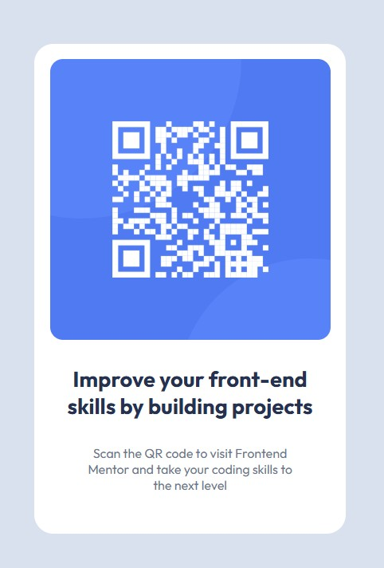

# Frontend Mentor - QR code component solution

This is a solution to the [QR code component challenge on Frontend Mentor](https://www.frontendmentor.io/challenges/qr-code-component-iux_sIO_H). Frontend Mentor challenges help you improve your coding skills by building realistic projects.

## Table of contents

- [Overview](#overview)
  - [Screenshot](#screenshot)
  - [Links](#links)
- [My process](#my-process)
  - [Built with](#built-with)
  - [Continued development](#continued-development)
  - [AI Collaboration](#ai-collaboration)
- [Author](#author)

## Overview

### Screenshot



### Links

- Solution URL: https://github.com/LostALife/qr-code-component-main
- Live Site URL: https://lostalife.github.io/qr-code-component-main/

## My process

### Built with

- Semantic HTML5 markup
- CSS custom properties
- Flexbox
- Mobile-first workflow

### Continued development

I would like to learn more about how these definitions for external font sets work.
It's easy to understand that adding the definitions here allows me to use the family throughout my site, but knowing how each line functions would be useful for future development.

```html
<link rel="preconnect" href="https://fonts.googleapis.com" />
<link rel="preconnect" href="https://fonts.gstatic.com" crossorigin />
<link
  href="https://fonts.googleapis.com/css2?family=Outfit:wght@100..900&display=swap"
  rel="stylesheet"
/>

<link
  rel="icon"
  type="image/png"
  sizes="32x32"
  href="./images/favicon-32x32.png"
/>
```

### AI Collaboration

Describe how you used AI tools (if any) during this project. This helps demonstrate your ability to work effectively with AI assistants.

- **What tools did you use:** I used the built in chatbot for VS Code for asking questions and getting information.
- **How did you use them:** Mainly just for things I have forgotten since I last worked with HTML and CSS. I turned off inline autocomplete, so that I actually had to type out what I was creating to improve memory.
- **What worked well:** It was pretty easy to get back into the groove of HTML without any issues. CSS took a bit longer, but habits started returning.
- **What didn't:** It took longer than I would like to remember how to center a div.

## Author

- Website - [GitHub - LostALife](https://github.com/LostALife)
- Frontend Mentor - [@LostALife](https://www.frontendmentor.io/profile/LostALife)
